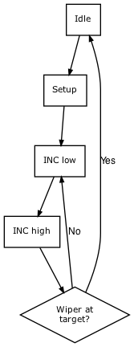

- [MAX5389 Driver Design](#orgd54c729)
  - [Platform requirements](#org250efb1)
  - [Timing characteristics](#orgd2a7f04)
  - [Design](#org0af41df)
    - [Initialization](#org3144b00)
    - [Setting resistance](#orgba1f440)
    - [Testing](#org1d113cc)


<a id="orgd54c729"></a>

# MAX5389 Driver Design

Assuming `gcc` is installed, test code can be executed as follows

```sh
$ make
$ ./test
```


<a id="org250efb1"></a>

## Platform requirements

-   132 MHz clock rate (7.5758 ns)
-   Setting must take < 40 ms (40,000 us)


<a id="orgd2a7f04"></a>

## Timing characteristics

**Modified from datasheet**

| Description              | Symbol | Value           |
|------------------------ |------ |--------------- |
| Maximum INC\_ Frequency  | fMAX   | 10 KHz (100 us) |
| CS to INC\_ Setup Time   | tCI    | 25 us           |
| CS to INC\_ Hold Time    | tIC    | 0 us            |
| INC\_ Low Period         | tIL    | 25 us           |
| INC\_ High Period        | tIH    | 25 us           |
| UD\_ to INC\_ Setup Time | tDI    | 50 us           |
| UD\_ to INC\_ Hold Time  | tID    | 0 us            |

To increment/decrement the wiper:

1.  Set:
    -   `CS_` low
    -   `UD_` high/low, respectively
2.  Wait the longer of `tCI` and `tDI`
3.  Set `INC_` low
4.  Wait `tIL`
5.  Set `INC_` high~
6.  Wait `tIH`
7.  Repeat from 3. as necessary

The `fMAX` requirement must also be met, which requires extending `tIL` / `tIH`.


<a id="org0af41df"></a>

## Design

The API for control of the MAX5389 is composed of two functions:

```c
s32 max5389_init(void);
s32 max5389_set_resistance(max5389_wiper_t wiper, u32 resistance, max5389_callback_t cb);
```


<a id="org3144b00"></a>

### Initialization

The initialization function must be called prior to calling any other function specified in the API. It set defaults for the wiper structure and configures the periodic timer.


<a id="orgba1f440"></a>

### Setting resistance

The caller can set the resistance of either wiper using the `max5389_set_resistance` function. This function takes the target wiper, the desired resistance (in Ohms) and an optional callback function which will be executed when the wiper reaches the desired resistance.

The caller can set the resistance of either wiper at any time (assuming the init function has been called), regardless of whether either wiper is already in transition.

1.  Theory of operation

    1.  Finite state machine

        Each wiper is represented as a finite state machine (FSM), comprised of the following states:

        1.  Idle: wiper is stationary; no request to change resistance
        2.  Setup: resistance change has been requested, `CS_` and `UD_` are set
        3.  INC low: `INC_` has been set low, moving the wiper in the desired direction
        4.  INC high: `INC_` has been set high, preparing the wiper for another move, or a return to Idle.

        The flow through the states is depicted as follows:

        

    2.  Timing

        To drive the FSM, a periodic timer is set to 20 KHz (50 us period). This frequency meets the following requirements:

        1.  50 us setup time for `UD_`
        2.  10 KHz maximum `INC_` frequency (comprised of a INC low and INC high state combination)

        Each increment/decrement therefore takes `n * 100 + 50` us, where n is the number of increments/decrements. With 256 taps, the maximum number of increments/decrements is 255, which gives a base, worst-case runtime of 25550 us, meeting the 40000 us requirement.

        Maintaining a constant frequency allows the two wipers to multiplex a single timer by maintaining individual state. For example, if Wiper A has been started for 3 changes and Wiper B is also started for 1 change a short time later:

        | Timestep | Wiper A  | Wiper B  |
        |-------- |-------- |-------- |
        | 0        | Idle     | Idle     |
        | 50       | Setup    | Idle     |
        | 100      | INC low  | Idle     |
        | 150      | INC high | Idle     |
        | 200      | INC low  | Setup    |
        | 250      | INC high | INC low  |
        | 300      | INC low  | INC high |
        | 350      | INC high | Idle     |
        | 400      | Idle     | Idle     |

        One caveat is that starting a second wiper movement will restart the periodic timer, in order to achieve the minimum timings for the second timer. In the worst case, the first wiper will be an epsilon away from transitioning when the second wiper resets the timer, which has the effect of adding an additional 50 us to the first wiper's transition. In the worst case, if the first wiper is traveling the full length of the potentiometer, the second wiper can be started 199 times before the 40 ms requirement is exceeded ((40000 - 100) / 200).

    3.  Callback

        The caller of the `set_resistance` function can optionally provide a callback, which is executed when the wiper reaches its target tap, passing the wiper identifier and current resistance.

        If a wiper is set to a different value while it is in motion, the previous callback is *not* executed, for simplicity. If a more complex feedback scheme is necessary, it would be straightforward to implement.

        The callback is executed in an interrupt context, which requires that work done in the callback be kept to a minimum. Ideally, it would set state or emit an event for further processing at a later time.


<a id="org1d113cc"></a>

### Testing

1.  Ensure that each wiper is able to move across the full range of the potentiometer, in both directions, within the timing requirements
2.  Ensure that wipers are able to move independently, simultaneously
    1.  A inc, B inc
    2.  A inc, B dec
    3.  A dec, B inc
    4.  A dec, B dec
3.  Ensure that if a new target resistance (A') is set while wiper (A) is in motion, it will achieve that target
    1.  A inc, A' higher
    2.  A inc, A' lower
    3.  A dec, A' higher
    4.  A dec, A' lower
4.  Ensure that in all cases wiper remains stable after reaching the target resistance
